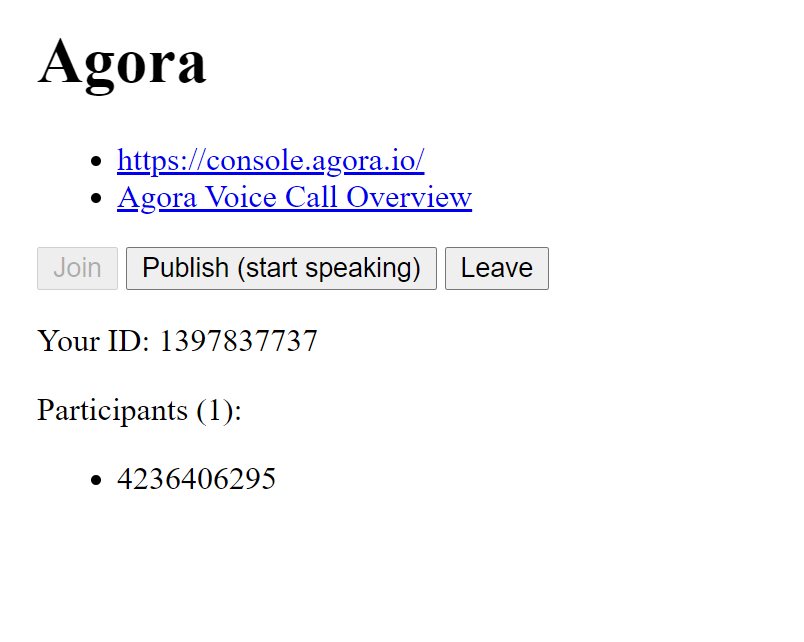

# Try Agora

Demo of Agora Voice Call.

## Agora?

- [Agora.io Real-Time Voice and Video Engagement - Agora.io](https://www.agora.io/en/)

> The Real-Time Engagement Platform for meaningful human connections.

## Try this

1. Clone this repo, and `npm ci`
2. Set up Agora account and project (app)
3. Generate a temp token
4. create `public/secrets.js` by copying `public/secrets.example.js`
5. OK then `npm run start`

## Try with friends

1. `npm run start`
2. Open another terminal (probably `Ctrl+T`)
3. `npm run serve:proxy`
4. Share HTTPS URL

Please make sure you share HTTPS one. Agora does not work over HTTP protocol.

## Trouble shooting

### Errors on load

> AgoraRTCError NOT_SUPPORTED: enumerateDevices() not supported.

> AgoraRTCError WEB_SECURITY_RESTRICT: Your context is limited by web security, please try using https protocol or localhost.

→ Run on `localhost`, or on `https://`.

### Error on join

> AgoraRTCError INVALID_PARAMS: Invalid token: . If you don not use token, set it to null

> Joining channel failed
> CAN_NOT_GET_GATEWAY_SERVER: dynamic use static key

→ Set `token`. Document says it's an option, but you need it.

### Error on publish

> AgoraRTCError INVALID_OPERATION: Can't publish stream, haven't joined yet!

→ Invoke `rtc.client.join()`.

### Error on somebody's leave

> TypeError: Cannot read property 'remove' of null

→ Check if the element exists.

The document describe to delete element which is the result of `document.getElementById(user.uid)`, but I didn't find where the element is created.

## More details

- Agora official: [Start a Voice Call](https://docs.agora.io/en/Voice/start_call_audio_web_ng?platform=Web)
