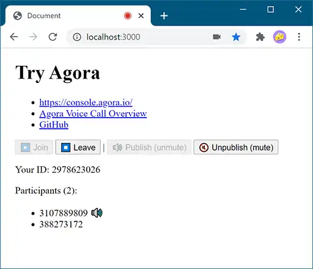

# Try Agora

Demo of Agora Voice Call.

## Agora?

- [Agora.io Real-Time Voice and Video Engagement - Agora.io](https://www.agora.io/en/)

> The Real-Time Engagement Platform for meaningful human connections.

## Where to see

Most of code are in [`public/main.js`](public/main.js). Find `main()` there.

### More details

Check out the official documentation.

- [Start a Voice Call](https://docs.agora.io/en/Voice/start_call_audio_web_ng?platform=Web)

## Try this

1. Clone or download this repo, and `npm ci`
2. Set up your [Agora](https://www.agora.io/en/) account with a project (app) for free
4. Copy `public/secrets.example.js` into `public/secrets.js`, and fill it
5. OK then `npm run start`

### Try with friends

You can temporarily share your localhost over [ngrok](https://ngrok.com/) to the internet.

1. Set up and `npm run start`
2. Open another terminal (most likely `Ctrl+T`-ish)
3. `npm run serve:proxy`
4. Share the HTTPS URL to your fiends

Please make sure you share HTTPS URL. It does not work over HTTP protocol.

## Trouble shooting

### Errors on load

> AgoraRTCError NOT_SUPPORTED: enumerateDevices() not supported.

> AgoraRTCError WEB_SECURITY_RESTRICT: Your context is limited by web security, please try using https protocol or localhost.

→ Run on `localhost`, or on `https://`. This happens when it's on `http://`.

### Error on join

> AgoraRTCException
> AgoraRTCError CAN_NOT_GET_GATEWAY_SERVER: dynamic use static key

→ Set `token`. Document says it's like optional, but you need it actually.

> AgoraRTCError INVALID_PARAMS: Invalid token: . If you don not use token, set it to null

→ Set `token` in your `secrets.js`. It should be left empty.

> Choose server https://webrtc2-ap-web-1.agora.io/api/v1 failed, message: AgoraRTCError CAN_NOT_GET_GATEWAY_SERVER: dynamic key expired, retry: false

→ Renew `token`. Expired. About 24 hours?

> AgoraRTCError CAN_NOT_GET_GATEWAY_SERVER: invalid token, authorized failed

→ Make sure the `token` is generated with exactly your channel name

### How to get `token`?

Here you go:

- [Project Management](https://console.agora.io/projects) > Edit > Features > Generate temp token

Or follow the document: [Generate a Token](https://docs.agora.io/en/Voice/token_server?platform=All%20Platforms)

### Error on publish

> AgoraRTCError INVALID_OPERATION: Can't publish stream, haven't joined yet!

→ Invoke `client.join()` first.

### Error on somebody's leave

> TypeError: Cannot read property 'remove' of null

→ Check if the element exists.

The document describes to delete an element which is the result of `document.getElementById(user.uid)`, but I didn't find where the element is created.
